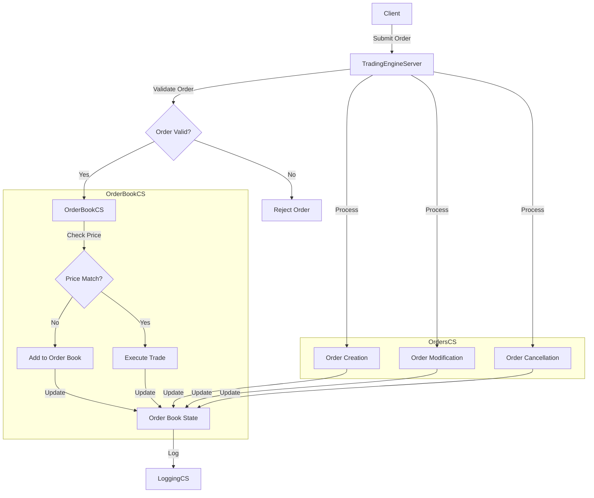

# Trading Engine Server

A high-performance trading engine implementation in C# that provides order book management, order matching, and trade execution capabilities.

## Project Overview

This trading engine is designed to handle financial market operations including:
- Order book management
- Order matching and execution
- Price discovery
- Order modifications and cancellations
- Trade execution

## Project Structure

The solution consists of several projects:

### TradingEngineServer
The main server project that orchestrates all components and provides the core trading engine functionality.

### OrderBookCS
Handles the order book implementation including:
- Order book state management
- Price level tracking
- Order matching logic
- Spread calculation

### OrdersCS
Manages all order-related operations:
- Order creation and validation
- Order modifications
- Order cancellations
- Order status tracking
- Rejection handling

### LoggingCS
Provides structured logging capabilities for the trading engine.

## System Flowchart



## Features

- **Order Book Management**
  - Price level tracking
  - Order matching
  - Spread calculation
  - Order book state maintenance

- **Order Operations**
  - New order submission
  - Order modifications
  - Order cancellations
  - Order status tracking
  - Rejection handling

- **Trading Features**
  - Limit orders
  - Price discovery
  - Order matching
  - Trade execution

## Getting Started

### Prerequisites
- .NET 6.0 or later
- Visual Studio 2022 or later (recommended)
- Git

### Installation

1. Clone the repository:
```bash
git clone [repository-url]
```

2. Navigate to the project directory:
```bash
cd TradingEngineServer
```

3. Build the solution:
```bash
dotnet build
```

4. Run the server:
```bash
dotnet run --project TradingEngineServer/TradingEngineServer
```

## Usage

The trading engine can be used to:
1. Submit new orders
2. Modify existing orders
3. Cancel orders
4. View order book state
5. Track trade executions

## Architecture

The system follows a modular design with clear separation of concerns:
- Interface-based design for modularity
- Dependency injection for service management
- Asynchronous operations
- Event-driven architecture

## Contributing

Contributions are welcome! Please feel free to submit a Pull Request.

## License

This project is licensed under the MIT License - see the LICENSE file for details.

## Acknowledgments

- Built as part of a learning project
- Inspired by real-world trading systems
- Uses modern C# practices and patterns
